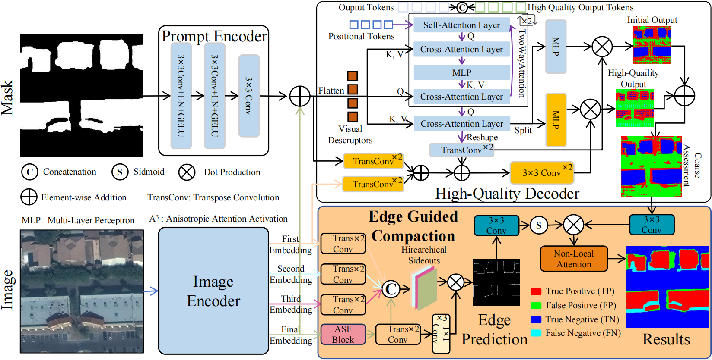

# SegAssess
The official code for unsupervised segmentation quality assessment model ["SegAssess: Panoramic quality mapping for robust and transferable unsupervised segmentation assessment"](https://arxiv.org/abs/2509.01183)<br>

**Abstract**<br>
High-quality image segmentation is fundamental to pixel-level geospatial analysis in remote sensing, necessitating robust segmentation quality assessment (SQA), particularly in unsupervised settings lacking ground truth. Although recent deep learning (DL) based unsupervised SQA methods show potential, they often suffer from coarse evaluation granularity, incomplete assessments, and poor transferability. To overcome these limitations, this paper introduces Panoramic Quality Mapping (PQM) as a new paradigm for comprehensive, pixel-wise SQA, and presents SegAssess, a novel deep learning framework realizing this approach. SegAssess distinctively formulates SQA as a fine-grained, four-class panoramic segmentation task, classifying pixels within a segmentation mask under evaluation into true positive (TP), false positive (FP), true negative (TN), and false negative (FN) categories, thereby generating a complete quality map. Leveraging an enhanced Segment Anything Model (SAM) architecture, SegAssess uniquely employs the input mask as a prompt for effective feature integration via cross-attention. Key innovations include an Edge Guided Compaction (EGC) branch with an Aggregated Semantic Filter (ASF) module to refine predictions near challenging object edges, and an Augmented Mixup Sampling (AMS) training strategy integrating multi-source masks to significantly boost cross-domain robustness and zero-shot transferability. Comprehensive experiments across 32 datasets derived from 6 sources demonstrate that SegAssess achieves state-of-the-art (SOTA) performance and exhibits remarkable zero-shot transferability to unseen masks, establishing PQM via SegAssess as a robust and transferable solution for unsupervised SQA.



1、Environment setting & Download checkpoints
=
* Setting the environment by command:
```python
pip install requirements.txt
```
* Download checkpoints of segmentation models, SAM and SegAssess to ./checkpoints. They can be downloaded from:<br>
**Google drive**:https://drive.google.com/drive/folders/18wrI3DaNrHM0p-VvhPKqQo_wGtQsQw_S?usp=sharing <br>
**Baidu drive**:[https://pan.baidu.com/s/1Rh5JIazNwnLvJU1NjirTHA](https://pan.baidu.com/s/1Rh5JIazNwnLvJU1NjirTHA (password:avha) <br>

2、Select model to predict unchecked segmentation maps
=
* Set the config file in ./configs
* If you plan to train a new segmentation model weight, specify config file in the main_seg.py and run:
 ```python
python main_seg.py -model_names='deeplabv3+' 
```
*  If you have downloaded weights from cloud and want to directly generate binary segmentation results for assessment: specify config file in the main_save_seg.py. The predicted segmentation maps are saved in 'ValRoot/seg_preds'
```python
seg_save_dir = os.path.join(configs['Paths']['ValRoot'], 'seg_preds')
```
*  run:
 ```python
python main_save_seg.py -model_names=['ocrnet']
```

3、SegAssess training and evaluation
=
* Set the config file in ./configs
* specify config file in the main_SegAssess_ddp.py or main.py
* For training, run in DDP mode:
 ```python
python main_SegAssess_ddp.py -eval=0 -eval_seg_model='ocrnet # eval_seg_model: All datasets support "deeplabv3+", "hrnet", "transunet", "unetformer", "ocrnet" . BAQS and WAQS additional support "raw"
```
or run in DP mode:
 ```python
python main.py -eval=0 -eval_seg_model='ocrnet 
```
* For evaluate, run in DDP mode:
 ```python
python main_SegAssess_ddp.py -eval=1 -eval_seg_model='ocrnet 
```
or run in DP mode:
 ```python
python main.py -eval=1 -eval_seg_model='ocrnet
```
If you'd like to save inference results, run:
```python
python main_SegAssess_ddp.py -eval=1 -eval_save_out=1 -eval_seg_model='ocrnet 
```

3、Datasets dictionary
=
**Examples for datasets**:<br>
Trainset: "/root/autodl-tmp/Datasets/Inria/train",<br>
Validset: "/root/autodl-tmp/Datasets/Inria/valid",<br>
Predicted segmentation maps: "/root/autodl-tmp/Datasets/Inria/valid/seg_preds/ocrnet".<br>
